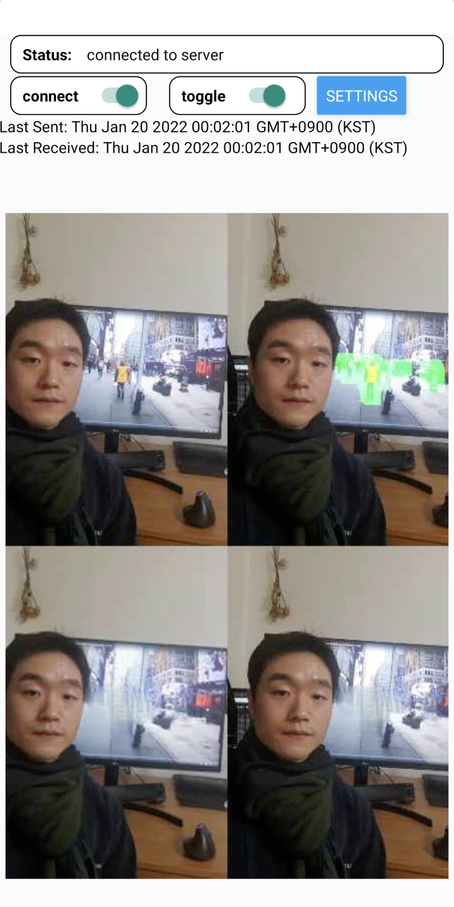

# PickyCam-server

### WARNING

- This repo is still on development. 


### How to Install

I strongly recommend you to work inside a virtual environment.

```bash
$ pip install -r requirements.txt
```


### How to Run Test

```bash
$ python serve_model.py --video {videopath}
```


### How to Run PickyCam server

```bash
$ python app.py --host {host} --port {port}

# i usually use
$ python app.py --port 8080
```

default setting of host is `localhost`, but  `port` is always requied. 


### How to Run PickyCam server (on Docker)

```bash
# make image (this may take 10~15 mins)
$ docker build -t pickycam . 

# run server on port 8080
$ docker run -it -port 8080:8080 --gpus all pickycam
```

The server runs on `localhost:8080` by default. If you want to change your server address, modify the last line of `Dockerfile`.


### Sample Result

Click below image to see sample result video on youtube

[](https://youtu.be/gUQtAsGLEO0)
